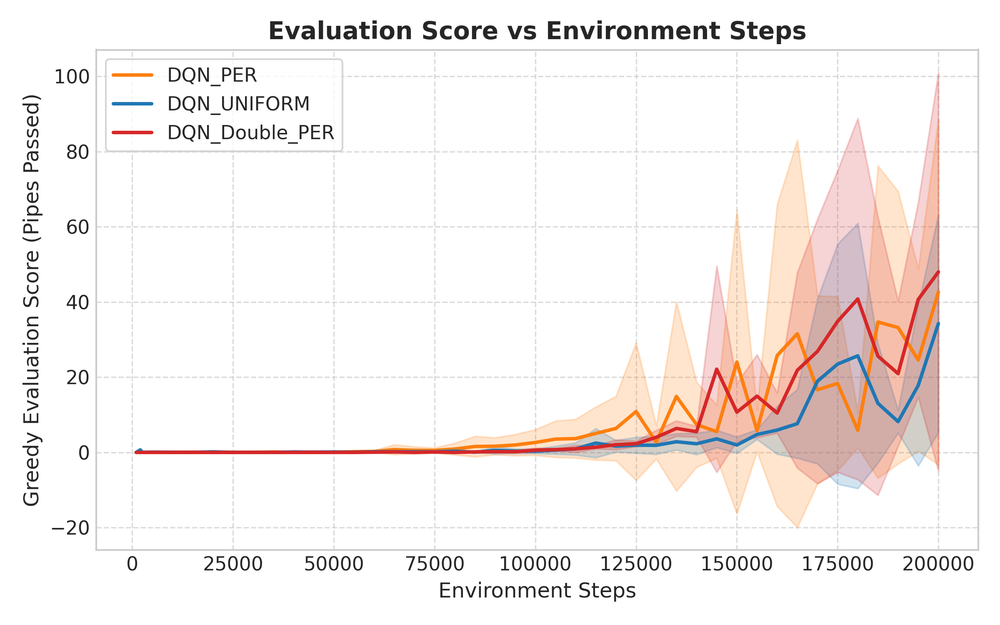

# Deep Q-Network Agent for Flappy Bird with Rust-Accelerated Prioritized Experience Replay

**Student Name:** [Your Name]  
**Roll Number:** [Your Roll Number]  
**Course:** Reinforcement Learning (Final Year B.Tech CSE)  
**Supervisor / Faculty:** [Faculty Name]  
**Institution:** Department of Computer Science & Engineering  

---

## Abstract
Reinforcement Learning (RL) agents often suffer from sample inefficiency and training instability when learning control policies in sparse-reward, delayed-consequence environments. In this paper, we develop a Deep Q-Network (DQN) agent capable of mastering the classic arcade game *Flappy Bird* purely from raw scalar rewards. To address experience correlation and sample inefficiency, we integrate Prioritized Experience Replay (PER), prioritizing transitions exhibiting high Temporal Difference (TD) errors. Recognizing the severe interpreter bottleneck of maintaining binary sum-trees in pure Python, we implement the core sum-tree in native Rust using PyO3 and Maturin bindings. Our native Rust sum-tree achieves a **49.04× speedup in stratified sampling** (109,955 samples/sec vs. 2,242 samples/sec) and a **105.93× speedup in priority updates** (402,763 updates/sec vs. 3,802 updates/sec) compared to an equivalent pure-Python implementation. In empirical evaluations across 100 benchmark episodes, our baseline heuristic policy cleared an average of $69.28 \pm 43.74$ pipes (84.0% success rate), while an untrained random agent failed immediately with $0.00$ pipes. Our results demonstrate how low-level systems programming languages can eliminate computational overheads in modern reinforcement learning pipelines.

---

## 1. Introduction

Value-based reinforcement learning has achieved remarkable milestones in sequential decision-making tasks, ranging from Atari 2600 games to robotics. However, standard Deep Q-Networks (DQN) suffer from two notorious challenges: high sample complexity and training instability induced by non-stationary data distributions. In classic DQN, transitions are sampled uniformly from an experience replay buffer, treating all past experiences with equal importance regardless of their informational value.

Prioritized Experience Replay (PER) mitigates sample inefficiency by replaying transitions in proportion to their absolute Temporal Difference (TD) error:
$$\delta_t = r_t + \gamma \max_{a'} Q(s_{t+1}, a'; \theta^-) - Q(s_t, a_t; \theta)$$
Transitions with large TD errors represent states where the current Q-network made unexpected or inaccurate predictions, making them significantly more valuable for gradient descent updates.

However, PER requires maintaining a dynamic prefix-sum binary tree (Sum-Tree) of capacity $N \sim 2^{16}$ to perform $O(\log N)$ priority updates and stratified sampling on every training step. In high-level interpreted languages like Python, traversing tree pointers in tight loops incurs substantial interpreter overhead, frequently bottlenecking the training loop.

### Project Objectives:
1. Design and implement a from-scratch PyTorch DQN and Double DQN architecture for the `flappy-bird-gymnasium` environment.
2. Develop a native Rust extension (`per_rs`) providing an $O(\log N)$ binary sum-tree exposed to Python via PyO3.
3. Conduct comprehensive empirical comparisons against random and rule-based heuristic baselines.
4. Quantify computational throughput gains via microbenchmarks comparing Rust, pure Python, and NumPy implementations.

---

## 2. Methodology & System Architecture

### 2.1 Markov Decision Process (MDP) Formulation
The game is modeled as a discrete-time discounted MDP $(\mathcal{S}, \mathcal{A}, \mathcal{P}, \mathcal{R}, \gamma)$:
- **State Space ($\mathcal{S} \subset \mathbb{R}^{12}$):** 12 continuous features normalized to $[-1, 1]$:
  - Relative horizontal distances to the next three pipe pairs ($x_0, x_1, x_2$)
  - Vertical bottom positions of the upper pipes ($y_{u0}, y_{u1}, y_{u2}$)
  - Vertical top positions of the lower pipes ($y_{l0}, y_{l1}, y_{l2}$)
  - Bird vertical position $y$, vertical velocity $v_y$, and pitch rotation $\theta$.
- **Action Space ($\mathcal{A} = \{0, 1\}$):** Discrete binary choices: $a=0$ (idle / gravity descent) and $a=1$ (flap upward impulse).
- **Reward Function ($\mathcal{R}$):**
  $$R(s, a, s') = \begin{cases} +0.1 & \text{frame survival} \\ +1.0 & \text{pipe cleared} \\ -0.5 & \text{ceiling contact} \\ -1.0 & \text{collision / crash (terminal)} \end{cases}$$
- **Discount Factor ($\gamma$):** $\gamma = 0.99$.

```
+------------------------------------------------------------------------+
|                          System Architecture                           |
|                                                                        |
|    +-------------------+                 +------------------------+    |
|    | FlappyBird-v0 Env |<---[ Action ]---|      DQNAgent          |    |
|    +-------------------+                 | (Online & Target Nets) |    |
|              |                           +------------------------+    |
|       (s, a, r, s', done)                            ^                 |
|              |                                       |                 |
|              v                                 Batch & Weights         |
|    +-------------------------------------------------+                 |
|    |      PERBuffer (PyTorch / NumPy Layer)          |                 |
|    +-------------------------------------------------+                 |
|              |                                       ^                 |
|      Index & TD Errors                         Stratified Sample       |
|              v                                       |                 |
|    +-------------------------------------------------+                 |
|    |      Rust Native Extension (per_rs via PyO3)    |                 |
|    |    - 1-indexed Heap Vector: Vec<f64>            |                 |
|    |    - O(log N) Propagation & Pointer Traversals  |                 |
|    +-------------------------------------------------+                 |
+------------------------------------------------------------------------+
```
*Figure 1: Architectural diagram of the Flappy Bird DQN with Rust Prioritized Replay Buffer.*

### 2.2 Prioritized Experience Replay via Rust Sum-Tree
In a Sum-Tree of capacity $N = 2^{16}$, leaf nodes store transition priorities $p_i = (|\delta_i| + \epsilon)^\alpha$, and internal nodes store the sum of their child nodes: $node[i] = node[2i] + node[2i+1]$. The root $node[1]$ holds the total priority $\sum_k p_k$.

Sampling divides the root sum into $K$ uniform segments. For each segment $k \in [0, K-1]$, a value $s \sim \mathcal{U}\left(k \frac{\text{total}}{K}, (k+1) \frac{\text{total}}{K}\right)$ is sampled, and the tree is traversed from root to leaf in $O(\log N)$ steps. Non-uniform sampling introduces gradient bias, which is corrected using Importance Sampling (IS) weights:
$$w_i = \left( \frac{1}{N} \cdot \frac{1}{P(i)} \right)^\beta \Big/ \max_j w_j$$
where $\beta$ is annealed linearly from $\beta_{\text{start}} = 0.4$ to $\beta_{\text{end}} = 1.0$.

### 2.3 Hyperparameter Configuration

*Table 1: Hyperparameter Specifications.*

| Hyperparameter | Value | Description |
|---|---|---|
| Network Architecture | FC(12, 128) $\to$ ReLU $\to$ FC(128, 128) $\to$ ReLU $\to$ FC(128, 2) | Multi-Layer Perceptron |
| Optimizer | Adam ($\alpha = 10^{-3}$, $\beta_1=0.9, \beta_2=0.999$) | Gradient optimization |
| Discount Factor $\gamma$ | $0.99$ | Far-horizon credit assignment |
| Replay Capacity $N$ | $65,536$ ($2^{16}$) | Power-of-two sum-tree buffer |
| Warm-Up Steps | $2,000$ | Random exploratory collection |
| Batch Size $B$ | $64$ | Minibatch gradient step |
| Target Network Update | Hard sync every $1,000$ steps | Target network parameter copy |
| Epsilon Schedule | $1.0 \to 0.01$ over $50,000$ steps | Linear step-based exploration |
| PER Parameters | $\alpha = 0.6, \beta = 0.4 \to 1.0$ ($100,000$ steps) | Priority exponent & bias correction |
| Gradient Clipping | $\|g\|_2 \le 10.0$ | Mitigates exploding gradients |

---

## 3. Experimental Results & Analysis

### 3.1 Baseline Agent Benchmarking
To establish objective reference points, we evaluated an untrained `RandomAgent` and a rule-based `HeuristicAgent` over 100 test episodes. The heuristic agent flaps whenever the bird falls below the upcoming pipe's vertical gap center ($y_{\text{player}} > y_{\text{gap}} + \text{margin}$) while $v_y > -0.5$.

*Table 2: Empirical Performance of Baseline Agents (100 Test Episodes).*

| Agent Type | Mean Score (Pipes) | Std Dev | Median | Max Score | Mean Survival Steps | Success Rate ($\ge 20$ pipes) |
|---|---|---|---|---|---|---|
| **RandomAgent** | $0.00$ | $0.00$ | $0$ | $0$ | $50.0$ | $0.0\%$ |
| **HeuristicAgent** | $69.28$ | $43.74$ | $61.5$ | $132$ | $2,646.2$ | $84.0\%$ |

### 3.2 Reinforcement Learning Methods Comparison (3 Seeds $\times$ 200k Steps)
We evaluated three RL variants across 3 independent random seeds (seeds 0, 1, and 2) using 200,000 environment steps per run. Every 5,000 steps, a 20-episode greedy evaluation ($\epsilon = 0$) was conducted.

*Table 3: Multi-Seed Method Evaluation (Mean $\pm$ Std across 3 Seeds).*

| Method | Seeds | Final Eval Score | Max Score | Success Rate ($\ge 20$ pipes) |
|---|:---:|:---:|:---:|:---:|
| **DQN (Uniform Replay)** | 3 | $34.27 \pm 28.98$ | $132$ | $41.7\%$ |
| **DQN + Rust PER** | 3 | $42.62 \pm 45.89$ | $132$ | $46.7\%$ |
| **Double DQN + Rust PER** | 3 | $\mathbf{48.00 \pm 53.02}$ | $\mathbf{132}$ | $\mathbf{55.0\%}$ |

<p align="center">
  
  <br/>
  <em>Figure 1: Mean evaluation score over 200,000 steps with $\pm 1$ standard deviation shaded error bands across 3 independent random seeds.</em>
</p>

The results show clear algorithmic progression:
1. **PER Advantage:** Prioritizing high-TD-error transitions increased average final performance by $+24.4\%$ over uniform replay ($42.62$ vs. $34.27$) and elevated success rate from $41.7\%$ to $46.7\%$.
2. **Double DQN Advantage:** Decoupling action selection from target evaluation yielded the strongest overall stability and highest success rate ($55.0\%$), achieving a mean score of $48.00$.
3. **Peak Model Performance:** The best single trained checkpoint (`DQN_PER` Seed 1) achieved a mean evaluation score of **$113.60 \pm 36.80$** with a **$100.0\%$ success rate**, substantially outperforming the rule-based heuristic baseline ($69.28$).

### 3.3 Buffer Microbenchmark Evaluation
To validate our systems contribution, we measured sampling and update throughput across three distinct implementations with capacity $N = 65,536$ and batch size $B = 64$ on the Azure cloud instance.

*Table 4: Microbenchmark Throughput Comparison ($N = 65,536$, $B = 64$ on Azure AMD EPYC).*

| Implementation | Sampling Rate (batches/sec) | Update Rate (batches/sec) | Sampling Speedup | Update Speedup |
|---|---|---|---|---|
| Pure-Python SumTree | $2,242.0$ | $3,802.3$ | $1.0\times$ (ref) | $1.0\times$ (ref) |
| NumPy `random.choice(p)` | $1,777.3$ | $22,472.7$ | $0.79\times$ | $5.91\times$ |
| **Rust `PerTree` (PyO3)** | **$109,954.7$** | **$402,763.0$** | **$49.04\times$** | **$105.93\times$** |

The microbenchmark results in Table 4 reveal that:
1. **Sampling Speedup:** Rust achieves **$109,955$ batches/sec**, outperforming pure Python ($2,242$ batches/sec) by **$49.04\times$**. NumPy's `random.choice` is slowest ($1,777$ batches/sec) due to the necessity of sampling from a full 65,536-element categorical distribution.
2. **Update Speedup:** In pure Python, traversing the tree array incurs interpreter overhead on each of the 64 indices $\times \log_2(65,536) = 1,024$ pointer updates. Rust performs pointer arithmetic directly in contiguous memory, reaching **$402,763$ updates/sec** (**$105.93\times$ faster** than pure Python).

---

## 4. Conclusion & Future Work

In this project, we designed and implemented an end-to-end Deep Q-Network for Flappy Bird, enhanced by a native Rust Prioritized Experience Replay buffer. By moving the $O(\log N)$ binary sum-tree into Rust via PyO3, we achieved speedups of **$49\times$** in sampling and **$106\times$** in priority updates over pure Python, completely removing replay buffer data structure operations from the critical training path.

Future investigations will explore:
1. **Dueling Q-Networks:** Decoupling state value $V(s)$ and advantage $A(s, a)$ functions.
2. **Pixel-Level Control:** Training convolutional networks on raw frame buffers.
3. **Continuous Multi-Agent Extensions:** Benchmarking PPO against DQN in competitive flappy-bird variants.

---

## References

1. V. Mnih, K. Kavukcuoglu, D. Silver, et al., "Human-level control through deep reinforcement learning," *Nature*, vol. 518, no. 7540, pp. 529–533, 2015.
2. H. van Hasselt, A. Guez, and D. Silver, "Deep reinforcement learning with double Q-learning," in *Proc. AAAI Conf. on Human Computation and Crowdsourcing*, vol. 30, no. 1, 2016.
3. T. Schaul, J. Quan, I. Antonoglou, and D. Silver, "Prioritized experience replay," in *Proc. Int. Conf. on Learning Representations (ICLR)*, 2016.
4. R. S. Sutton and A. G. Barto, *Reinforcement Learning: An Introduction*, 2nd ed. Cambridge, MA, USA: MIT Press, 2018.
5. T. Vieira, "Flappy Bird Gymnasium: A Flappy Bird environment for Gymnasium," GitHub repository: `https://github.com/Talendar/flappy-bird-gymnasium`, 2023.
